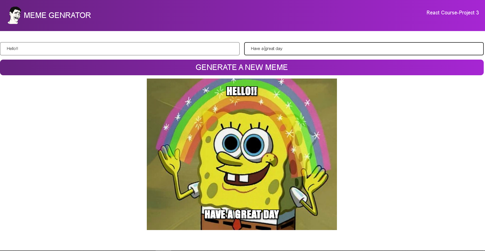

################################################
Welcome to my React Js Project 3.

Meme generator.

In this app the meme image are fetched from api.

You can also add text at top and bottom of the image.

On clickling the buttom a new meme image is generated.

All the data from api are stored in useState Array object from where url of image are extracted.

Please feel free to visit my app.

https://fa5cf2d3fe4c-shared.lowcodeunit.com/

###########################################################

